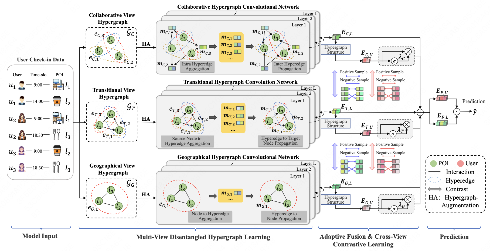

This project is the combined of two paper. FGCRec: Fine-Grained Geographical Characteristics Modeling for Point-of-Interest Recommendation[1] and Disentangled Contrastive Hypergraph Learning for Next POI[2] Recommendation. Where the method and code base is come from the [2] and dataset is given by [1]. Where the experiment reveals that the [2] method significantly enhance the performance of [1] given by the processed dataset from 0.04 to 0.21 in Recall top 10.

For generally use, please rewrite the code path to direct to a proper location.





## Running
```
python3 run.py --dataset NYC
python3 run.py --dataset TKY
python3 run.py --dataset FGCREC
```


## License
```
MIT License

Copyright (c) 2024 Yantong Lai Modyfied by Pascal Wong

Permission is hereby granted, free of charge, to any person obtaining a copy
of this software and associated documentation files (the "Software"), to deal
in the Software without restriction, including without limitation the rights
to use, copy, modify, merge, publish, distribute, sublicense, and/or sell
copies of the Software, and to permit persons to whom the Software is
furnished to do so, subject to the following conditions:

The above copyright notice and this permission notice shall be included in all
copies or substantial portions of the Software.

THE SOFTWARE IS PROVIDED "AS IS", WITHOUT WARRANTY OF ANY KIND, EXPRESS OR
IMPLIED, INCLUDING BUT NOT LIMITED TO THE WARRANTIES OF MERCHANTABILITY,
FITNESS FOR A PARTICULAR PURPOSE AND NONINFRINGEMENT. IN NO EVENT SHALL THE
AUTHORS OR COPYRIGHT HOLDERS BE LIABLE FOR ANY CLAIM, DAMAGES OR OTHER
LIABILITY, WHETHER IN AN ACTION OF CONTRACT, TORT OR OTHERWISE, ARISING FROM,
OUT OF OR IN CONNECTION WITH THE SOFTWARE OR THE USE OR OTHER DEALINGS IN THE
SOFTWARE.
```

